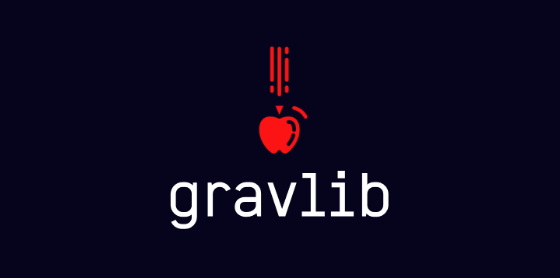

<p align="center">
    
</p>

<p align="center">
    
    
    
    
</p>
<hr>


## Welcome To the 1831A Push Back Code Archive! 🔥🚀
---
Welcome Adventurer! This repository is the effort of the programmer of the HS V5RC team **1831A**! 

With this project, we are aiming to extend upon the existing LemLib project by @SizzinSeal and its contributors, optimising it for the "Push Back" season, as well as exploring the contents of *Rust* through creating our own library in this language. This repository also serves as an archive for the whole of the V5RC "Push Back" season, allowing members, judges and other teams alike to sift through how our team developed thoughout this season. 

If you decide to use our code, please consider **starring our project** (and lemlib and **gravlib** (our personal project)) to support us!

[GravityLib Repository](https://github.com/GravityLib/GravLib/tree/main)

---

## License
This project is licensed under the MIT license. Check [LICENSE](https://github.com/venus-beetroot/1831A-Push-Back/blob/main/LICENSE) for more details. (TODO Change)

## Table of Contents  

- [About Us](#about-us)  
- [Project Structure](#project-structure)  
- [Getting Started](#getting-started)  
- [Features](#features)  
- [How to Contribute](#how-to-contribute)  
- [License](#license)  

---

## About Us  

**Team 1831A** is a currently active V5RC **HS** team based in **The King's School, Paramatta, Sydney Australia** competing in the VEX Robotics Competition 2024-2025 "High Stakes". 

<!--
NOTE - Commented out
---
## Project Structure  

Here's an overview of the repository:  

```
1831E-Robotics/
├── include/            # Header files for modular design  
│  
├── src/                # Source code for the robot  
│   ├── main.cpp            # Main entry point of the program  
│   ├── controls.cpp        # Code for specific robot subsystems (e.g., drive, lift, claw)  
│   └── robot-config.cpp    # Mostly constructurs for initiating robot devices & sensors
│
└── README.md           # Repository overview  
```  
-->
---

## Getting Started  

### Prerequisites  

Before running the code, ensure you have the following installed:  
- PROS API (https://pros.cs.purdue.edu/) *Recommended through VSCode Extension 
- VEX V5 Brain and Controller  
- Robot configured with necessary hardware components.
- Rust API (TODO)

### Installation  

1. Clone the repository to your local machine:  
   ```bash  
   git clone https://github.com/venus-beetroot/1831A-Push-Back.git  
   ```  
2. Open the project in VScode

3. Build and deploy the code to the robot. with "pros mu" (TODO Change)

---

## Features  

- **Autonomous Modes**: Optimized routines for various competition scenarios.  
- **Driver Control**: Streamlined controls for intuitive operation.  
- **Subsystem Modularity**: Easy-to-modify subsystems for efficient development.  
- **Error Handling**: Robust mechanisms to detect and handle runtime issues.  (TODO Change)

---

## How to Contribute  

We welcome contributions! But before you do so, please read the below: 

We heavily recommend using the **GitHub Desktop** Application if you are **unfamiliar with github**, but otherwise, you can also use the CLI if you feel comfortable enough.

To contribute:
1. Fork this repository.  
2. Create a feature branch:  
   ```bash  
   git checkout -b feature-name  
   ```  
3. Commit your changes:  
   ```bash  
   git commit -m "Add feature-name"  
   ```  
4. Push your changes and create a pull request! (Thanks for contributing!)
---

## License  

This project is licensed under the MIT License. See the `LICENSE` file for details.  

---  

Thanks for reading my clumsy writing, happy coding!

Cheers! 🍻

Haoran Fang (venus-beetroot) - Programmer of 1831A


